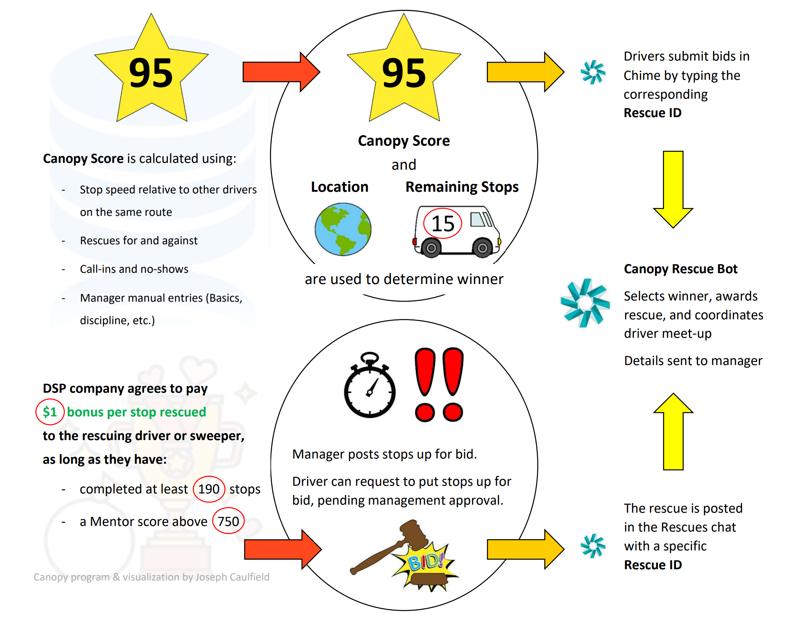
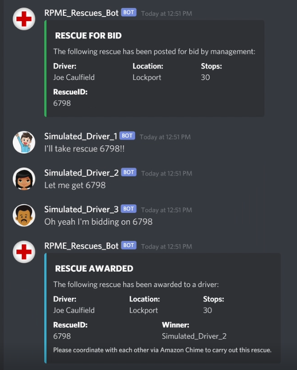
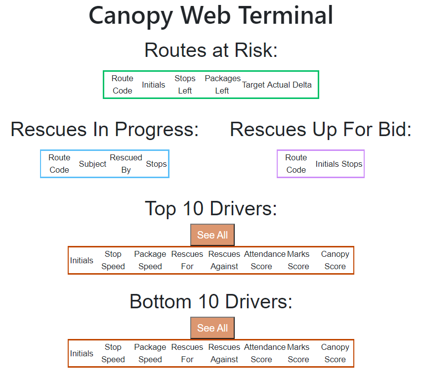

# Canopy

I built this application while I was working as a delivery driver. 

Our company had a policy for drivers who couldn't complete their delivery route on time. 
Basically, another driver - who was finished or almost finished - would have to "rescue" a number 
of packages from the lagging driver.

There was no payment or incentive to do this, and it was highly resisted. I proposed a solution.

### The Solution

I proposed the company pay drivers a small bonus for rescuing packages ($0.50 - $1 per package).
I believed as a result, drivers would no longer dread rescues but instead *look forward* to them.

However, I also believed introducing incentives would bring a new challenge: multiple drivers would
be competing to finish their routes quickly so they could rescue packages. This would mean management
would have to choose who gets to rescue and get paid the bonus.

Canopy solves this problem.

### What is it?

Canopy is a merit-based bidding application designed to award drivers with the best stats the opportunity
to rescue packages and get paid bonuses.

There are 3 main components to this application:
1. Scoring drivers based on performance.
2. Providing a platform to bid on doing rescues.
3. Automated selection of a bid winner based on merit score.

#### 1. Scoring

Drivers are scored based on a number of data points, including:
```shell
Package delivery speed (packages per hour)
Number of rescues conducted
Number of no-call-no-shows
```
Their final score - dubbed a "Canopy Score" - represents their efficiency as a delivery driver.

#### 2. Bidding Platform

Canopy interfaces with Discord to give drivers a channel to communicate and place their bids on 
pending rescues. 

Part of the application is a Discord bot that notifies all drivers of a pending
rescue once management has decided that someone does indeed need a rescue and commits it to the app. 
A "bid" is simply when a driver publishes a message in the channel claiming they would like to 
take that particular rescue.

The application waits a period of time to give all drivers a chance to bid and then selects a winner.

#### 3. Winner Selection

Canopy will gather all drivers that submitted a bid on a particular rescue and look up their Canopy Score.
The highest Canopy Score wins the bid and gets awarded the rescue! They get to pick up those packages and
get paid the bonus incentive!

**All management has to do is commit a rescue to the Canopy application using the web UI, and 
everything else is automated.**

### My Presentation to Management



### Some Action Shots



